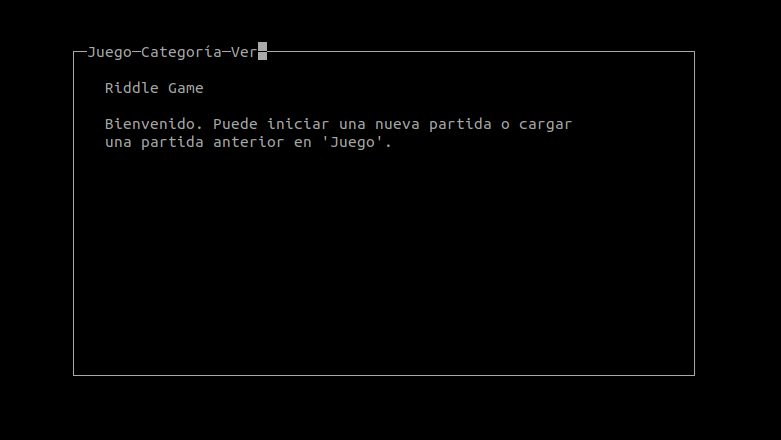
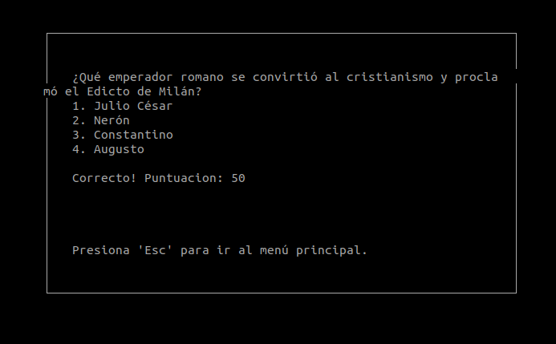
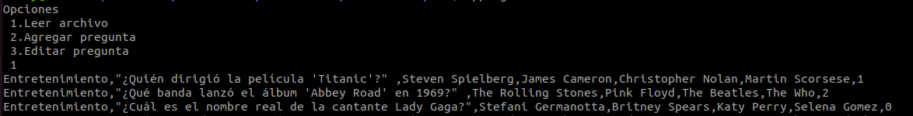

# Introducción

El presente proyecto denominado Riddle-Game, consiste en un juego de trivia desarrollado  por medio del lenguaje de programación C, en el cual se busca poner a prueba los conocimientos de la persona usuaria en diversos tópicos como Ciencia, Historia y Entretenimiento. Dentro del juego, el usuario tiene la oportunidad de seleccionar una pregunta dentro cuatro posibilidades, si la opción es correcta al usuario se le desplegará un mensaje de felicitación junto con su respectiva puntuación que se irá acumulando. Así mismo, a la persona se le ofrece la posibilidad de modificar, agregar y borrar las preguntas que se encuentran implementadas en la estructura del programa. 

## Construido con
Este proyecto fue construido con las siguientes librerías:
* ncurses.h
* stdio.h
* stdlib.h
* time.h
* ctype.h

## Empecemos
Para ejecutar este programa, debes seguir los siguientes pasos:

1. **Compilación:** Para poder compilar el programa, se debe instalar el programa meson. Para esto ingresa debes instalar lo siguiente:
  * **pip3**
```
sudo apt install python3-pip
```
  * **ninja**
```
sudo apt install ninja-build
```
  * **meson**
```
pip install meson
```

2. **Librería ncurses:** También se debe instalar la librería ncurses para poder visualizar la interfaz.
  * `ncurses`: sudo apt install libncurses5-dev libncursesw5-dev

3. **Configuración del directorio build:** Antes de compilar el programa, se debe configurar un directorio de construcción utilizando meson. Esto prepara el entorno de compilación.
```
meson setup build
```

4. **Compilación:** Una vez preparado el directorio, se compila el programa utilizando meson.
```
meson compile -C build
```

5. **Ejecución:**
* Para ejecutar el juego, ingresa:
```
./build/game
```
* Para ejecutar el programa para editar preguntas, ingresa:
```
./src/preguntas
```

### Implementación

Para este proyecto se estuvo desarrollando código de manera conjunta, se realizaron varios archivos de texto .c tanto para lograr la funciones finales como también para agregar algunas a futuro, se priorizo la utilización de bibliotecas externas para el desarrollo del proyecto, el juego como tal se  programó de acuerdo a la biblioteca de interfaz gráfica que se selecciono y se implementamos un orden algorítmico para que el código corriera correctamente.

`Questions.c`

Contiene la estructura de las preguntas, qué forma tienen, que tipo de variable  es y cómo se manejan, para esta primera parte se realizó a las preguntas como una variable estructural que en si iba a tener varias variables tales como “pregunta” qué es la variable de texto que contiene la pregunta como tal seguido de la variable “categoría” que es una variable de texto también, que contiene una de las tres categorías que se  contemplaron para el proyecto tales fueron: ciencia, historia y entretenimiento, luego también una variable que se trató como una lista: opciones, que contiene las opciones de respuesta que se hay para la pregunta, y por último una variable int: opcioncorrecta que es la contiene el índice de la respuesta correcta a la pregunta.  
	
Seguido de encontrar la estructura para las preguntas, como parte de los objetivos se tiene el de realizar un programa que ayude a leer agregar y editar la preguntas que se utilizaron para el juego, se procedió con la programación  de un archivo con tres funciones que ayudaron a cumplir con este objetivo. 

Primero se realizó la función más básica y fácil de programar Leer Preguntas, para esta simplemente se implementó la lectura del archivo que posee las preguntas seguido de su impresión.

Seguido de esto se realizó agregar Pregunta donde se abre el archivo de texto que contiene las preguntas en forma de escritura y se agrega la nueva pregunta a partir de lo que el usuario va agregando a cada apartado de la “pregunta” el abrir el archivo en modo de escritura no representó mayor dificultad, es algo que se hace seguido cuando se programa, luego escribir en este cumpliendo con la estructura que se ideó para las preguntas fue lo que presentó un reto mediano, pues se tuvo que indagar entre los comandos y funciones que brindan las bibliotecas implementadas.

Gracias a ellas se pudo completar la función de manera exitosa. 

El mayor problemas lo presentó la función de editar las preguntas, en este se debía implementar al mismo tiempo el leer las preguntas como también escribir sobre ellas, lo que se hizo fue abrir el archivo y dividirlo según su categoría, se le pregunta al usuario en que categoria esta la pregunta que desea editar luego las preguntas de esta categoría se encuentran en una lista que es impresa para que el usuario pueda elegir que pregunta desea editar, cuando el usuario elije el índice de la pregunta que desea editar se le pregunta por cuál es la sección  de la pregunta que se desea editar y se procede a su edición, para esta función la dificultad fue abrir el archivo, si esto se hacía de la misma manera que en la de leer preguntas el código tiraba errores y no leía correctamente las preguntas, se detectó que esto era porque la lista de preguntas poseía mayúsculas al inicio de sus textos, para esto se implementó la biblioteca ctype que brinda un comando que funciona para para texto a minúscula, cuando esto se implementó la funcionalidad del código se mantuvo firme y concisa.   

`Score.c`

Este utiliza stdlib.h,string.h, esta función lo que realiza  es abrir el archivo de las preguntas en forma de lectura al igual que la función de leer preguntas del archivo anterior, luego elige una pregunta aleatoriamente(del archivo de preguntas que abrió) como también se codifica para que muestre la pregunta en la interfaz gráfica una vez la pregunta es seleccionada según su categoría para lo cual se implementa ncurses y por último obtiene la respuesta que el usuario con un input del usuario.

`Game.c`

Utiliza la biblioteca ncurses, este archivo llama a la función que lee el archivo, y una vez se implementa esta función el código procede a realizar el display en la ventana, como también posee el código que permite al usuario que elija una opción dentro de las cuatro que son mostradas por cada pregunta

`menu.c` 

Este archivo utiliza ncurses y string.h este archivo posee todo el código necesario para montar el menú y submenú como también los displays de estos mismos, string.h se implementa para poder elegir las categorías según el usuario vaya navegando por el menú. 

`main.c` 

Este archivo inicializa a ncurses y llama también a la función menú que se encuentra dentro de menu.c. Como parte de código que se empezó a desarrollar pero por una u otra razón finalmente no se pudo implementar en la funcionalidad final(presentación del proyecto) se encuentra el archivo matches.c:

Este archivo utiliza time.h y stdlib.h, primeramente tiene una función que obtiene el tiempo que retorna un string que contiene la fecha y hora en la que se consiguió la puntuación del juego que se pauso, luego tiene la función match que toma la puntuación que consiguió el usuario durante el juego y lee el abre el archivo en el que se lleva el registro de las partidas y escribe en él una línea con el string que devuelve la función anterior como también le agrega la puntuación obtenida por el usuario durante la partida.

## Utilización

Después de escribir `./build2/game` en la terminal de linux, al usuario se le muestra lo siguiente:



Por consiguiente, se puede comenzar a jugar apretando la tecla “j”, posteriormente la opción nuevo juego y con las flechas se escoge la opción “nuevo juego” para que aparezca la primera pregunta. Para elegir la opción que deseas solo oprime un número del 1 al 4: 



Seguidamente, para volver al menú nada más se teclea ESC. Para leer, agregar o editar una preguntas, se tiene que escribir ./src/preguntas y escoger cualquiera de las opciones previamente mencionadas. En este caso se oprimió la tecla 1 como se muestra a continuación:



## Conclusiones 

Se puede determinar la consecución de un juego que permitiese la interacción humano-máquina, principalmente para poner a prueba las habilidades adquiridas a lo largo del curso.

Así mismo, gracias a este proyecto de programación en C, se logró adquirir los conocimientos necesarios con fin de poder transformar e implementar distintas librerías externas como ncurses y string.h en la en la elaboración del trabajo.

Igualmente, se puso en práctica el trabajo en equipo como herramienta indispensable en consecución de los objetivos necesarios para la construcción del script. Además, se pudo integrar completamente en uno solo, los diferentes mini-programas que habían realizados por cada uno de los integrantes del grupo.

Por último, se alcanzó el objetivo de construir una estructura base importante del programa que luego podría ser útil en proyectos futuros que involucren interacciones humano-máquina.

## Roadmap
En el futuro, se pretende incluir las siguientes versiones:
Agregar más categorías de preguntas.
Acceso y visualización a las partidas anteriores desde la interfaz.
Selección del nivel de dificultad de las preguntas.
Registro de tiempo que tarda el usuario en responder, y visualización en vivo de este tiempo.
Informe de puntuación de partidas desde la interfaz.

## Licencia
Licencia de libre uso.

## Contacto
En caso de alguna duda con respecto al programa, se puede contactar a las siguientes personas:
* Daniela Fonseca, github: @dfonsecz, email: daniela.fonsecazumbado@ucr.ac.cr
* Fabián González,github @fabegu01, email: fabian.gonzalezurena@ucr.ac.cr
* Asbel Mena @chimichurre

## Referencias
A continuación, es posible encontrar documentación de las librerías utilizadas en la elaboración de este proyecto.
1. IBM i 7.5. (s. f.). https://www.ibm.com/docs/es/i/7.5?topic=files-stdlibh
2. IBM i 7.5. (s. f.-b). https://www.ibm.com/docs/es/i/7.5?topic=files-timeh
3. IBM i 7.5. (s. f.-c). https://www.ibm.com/docs/es/i/7.5?topic=files-stringh
4. ncurses Manpages https://invisible-island.net/ncurses/man/ncurses.3x.html
